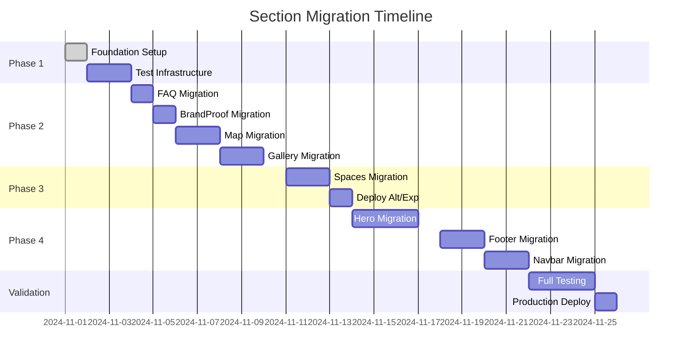

# Section Component Migration Plan
## From Legacy `Section` to Modern `SectionShell` + `SectionLayout`

---

## Executive Summary

This plan outlines the migration from the current monolithic `Section` component to a modern, composable architecture using `SectionShell` (visual frame) and `SectionLayout` (content orchestration). The new architecture provides better separation of concerns, improved testability, and modern CSS features like container queries.

---

## Current State Analysis

### Components Using Legacy `Section`
1. **AlternatingBlocks** - Complex layout with wrapper mode (`✅ Modern version created`)
2. **Experience** - 2-column with features grid (`✅ Modern version created`) 
3. **Gallery** - Masonry grid with wide content
4. **BrandProof** - Full-bleed with rose tint
5. **Map** - 2-column with iframe embed
6. **FAQ** - Accordion with centered header
7. **Spaces** - New wrapper mode implementation

### Legacy Section Features Used
- **Container modes**: `rails` (dual-rail) and `wrapper` (single container)
- **Width presets**: `prose`, `content`, `wide`, `full`
- **Backgrounds**: `surface`, `tint-rose`, `tint-sage`, gradients, images
- **Dividers**: `none`, `hairline`, `thread-gold`
- **Padding presets**: `xs`, `sm`, `md`, `lg`, `xl`, `fluid`
- **Alignment**: `left`, `center`, `right`
- **Named variants**: Component-specific presets

---

## Migration Strategy

### Phase 1: Foundation (Week 1)
**Goal**: Establish parallel architecture without breaking existing components

#### Tasks:
- [x] Install Radix UI dependencies (`@radix-ui/react-slot`)
- [x] Create `SectionShell` component
- [x] Create `SectionLayout` component  
- [x] Add CSS for new components
- [x] Create demo page showing old vs new
- [ ] Set up Playwright tests for migration validation

### Phase 2: Low-Risk Components (Week 1-2)
**Goal**: Migrate simple, static components first

#### Priority 1 - Simple Layouts:
1. **FAQ** (simplest, centered layout)
   - Current: Basic Section with centered header
   - Migration: `SectionShell` + `variant="legacy-full-centered"`
   - Risk: Low
   - Test: CSS comparison, accordion functionality

2. **BrandProof** (full-bleed, simple content)
   - Current: Full-bleed with tint-rose background
   - Migration: `SectionShell` with `bleed={true}` + simple layout
   - Risk: Low
   - Test: Visual regression, bleed rendering

#### Priority 2 - Medium Complexity:
3. **Map** (2-column with iframe)
   - Current: Standard Section with content grid
   - Migration: `SectionShell` + `variant="split-hero"`
   - Risk: Medium (iframe behavior)
   - Test: Map rendering, responsive behavior

4. **Gallery** (masonry grid)
   - Current: Wide content rail with grid
   - Migration: `SectionShell` + `variant="gallery-masonry"`
   - Risk: Medium (responsive grid)
   - Test: Grid layout, image loading

### Phase 3: Complex Components (Week 2-3)
**Goal**: Migrate components with complex layouts

5. **Spaces** (new wrapper implementation)
   - Current: Uses new `container="wrapper"` mode
   - Migration: Direct port maintaining wrapper logic
   - Risk: Medium
   - Test: Container math, responsive behavior

6. **AlternatingBlocks** ✅ (zigzag layout) 
   - Modern version already created
   - Test: A/B comparison with legacy version
   - Deploy: After visual validation

7. **Experience** ✅ (2-column features)
   - Modern version already created
   - Test: Feature grid alignment
   - Deploy: After validation

### Phase 4: Global Components (Week 3-4)
**Goal**: Migrate site-wide components

8. **Hero** (homepage hero)
   - Current: Complex with overlay, actions
   - Migration: `variant="home-hero-2024"`
   - Risk: High (critical first impression)
   - Test: Extensive visual regression

9. **Footer** (site footer)
   - Current: Multi-column layout
   - Migration: Custom layout variant
   - Risk: High (site-wide impact)
   - Test: Link functionality, responsive

10. **Navbar** (navigation)
    - Current: Sticky positioning
    - Migration: May need custom handling
    - Risk: High (navigation critical)
    - Test: Sticky behavior, menu states

---

## Testing Strategy

### Automated Testing
```typescript
// Use existing Playwright infrastructure
test('Migration: FAQ section parity', async ({ page }) => {
  // 1. Load both versions
  await page.goto('/demo/modern-sections')
  
  // 2. Find sections by data attributes
  const oldSection = await page.locator('[data-section="faq"]:not(.modern)')
  const newSection = await page.locator('[data-section="faq"].modern')
  
  // 3. Compare computed styles
  const oldStyles = await extractStyles(page, oldSection)
  const newStyles = await extractStyles(page, newSection)
  
  // 4. Assert critical properties match
  expect(compareStyles(oldStyles, newStyles)).toMatchCriteria({
    padding: { tolerance: 1 },
    margin: { tolerance: 1 },
    fontSize: { tolerance: 0.1 },
    color: { exact: true }
  })
})
```

### Visual Regression
- Screenshot comparisons at key breakpoints (mobile, tablet, desktop)
- Dark/light theme validation
- Interaction states (hover, focus, active)

### Manual Testing Checklist
- [ ] Storyblok live editing works
- [ ] Dark mode transitions smooth
- [ ] Responsive breakpoints correct
- [ ] Accessibility maintained (ARIA, keyboard nav)
- [ ] Performance metrics stable

---

## Implementation Guide

### Component Migration Template
```tsx
// OLD: ComponentName.tsx
import Section from '@/components/ui/Section'

export default function ComponentName({ blok }) {
  return (
    <Section
      align="center"
      width="content"
      paddingY="lg"
      background="surface"
      header={{ title, lead }}
    >
      {/* content */}
    </Section>
  )
}

// NEW: ComponentNameModern.tsx
import SectionShell from '@/components/ui/SectionShell'
import SectionLayout from '@/components/ui/SectionLayout'

export default function ComponentNameModern({ blok }) {
  return (
    <SectionShell
      container="content"
      paddingY="lg"
      background="surface"
    >
      <SectionLayout
        variant="appropriate-variant"
        rails={{ contentWidth: 'content', align: 'center' }}
        header={{ title, lead, align: 'center' }}
      >
        {/* content */}
      </SectionLayout>
    </SectionShell>
  )
}
```

### Variant Mapping Guide
| Old Pattern | New Variant |
|------------|-------------|
| `align="center"` all | `variant="legacy-full-centered"` |
| Header center, content left | `variant="header-center-content-left"` |
| Alternating blocks | `variant="alternating-blocks"` or `zigzag-2col` |
| Gallery grid | `variant="gallery-masonry"` |
| 2-column split | `variant="split-hero"` |
| Features grid | `variant="experience-2col"` |

---

## Rollback Plan

### Feature Flags
```tsx
// Use environment variable for gradual rollout
const USE_MODERN_SECTIONS = process.env.NEXT_PUBLIC_USE_MODERN_SECTIONS === 'true'

export default function ComponentWrapper({ blok }) {
  if (USE_MODERN_SECTIONS) {
    return <ComponentModern blok={blok} />
  }
  return <ComponentLegacy blok={blok} />
}
```

### Emergency Rollback
1. Set `NEXT_PUBLIC_USE_MODERN_SECTIONS=false`
2. Deploy immediately
3. Components revert to legacy Section
4. No data migration needed

---

## Success Metrics

### Performance
- [ ] Lighthouse score maintained or improved
- [ ] First Contentful Paint < 1.5s
- [ ] Cumulative Layout Shift < 0.1

### Quality
- [ ] Zero visual regressions (verified by Playwright)
- [ ] All existing tests pass
- [ ] Storyblok preview working

### Developer Experience
- [ ] Reduced component complexity
- [ ] Improved type safety
- [ ] Better documentation

---

## Timeline



---

## Next Steps

1. **Immediate**: Create FAQ modern component (simplest migration)
2. **Today**: Set up A/B test page for visual comparison
3. **This Week**: Migrate all Priority 1 components
4. **Next Week**: Complete Phase 3 complex components

---

## Notes

- The new architecture is backward compatible - both can coexist
- Container queries provide better component isolation than viewport queries
- Logical properties (inline/block) improve RTL support
- Named variants reduce configuration complexity
- Radix Slot pattern enables flexible element composition

---

## Commands for Testing

```bash
# Run specific section comparison
SECTION=faq npm run test:css-compare

# Run visual regression tests
npm run test:visual

# Check all sections for parity
npm run test:sections

# Run with tolerance adjustment
TOLERANCE=2 npm run test:css-compare
```